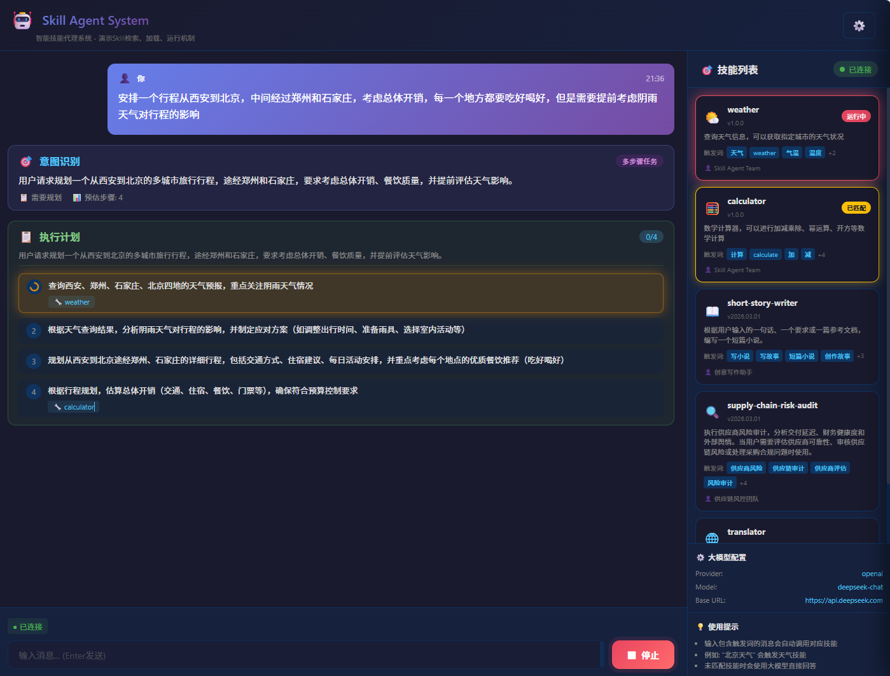
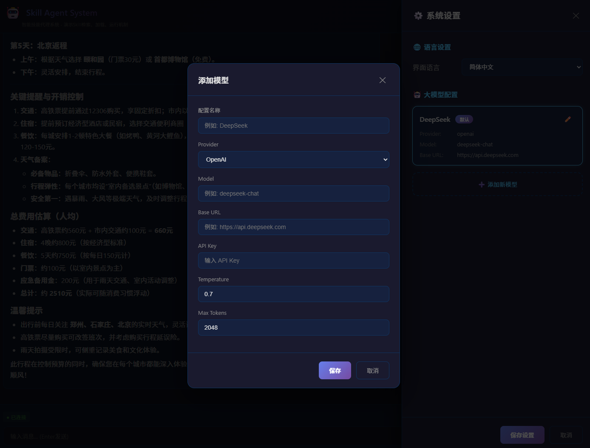

# Skill Agent System

一个完整的Agent工程，用于演示市面上标准的Skill检索、加载、运行机制。



## 系统架构

```
skillplay/
├── backend/                 # 后端服务 (Bun)
│   ├── src/
│   │   ├── index.ts        # 入口文件
│   │   ├── types.ts        # 类型定义
│   │   ├── services/       # 服务层
│   │   │   ├── config-service.ts      # 配置管理
│   │   │   ├── skill-service.ts       # Skill管理
│   │   │   ├── llm-service.ts         # 大模型对接
│   │   │   └── conversation-service.ts # 对话上下文
│   │   └── handlers/
│   │       └── websocket-handler.ts   # WebSocket处理
│   └── package.json
├── frontend/               # 前端服务 (Vite + Vue3)
│   ├── src/
│   │   ├── App.vue
│   │   ├── main.ts
│   │   ├── components/
│   │   │   ├── ChatWindow.vue    # 聊天窗口
│   │   │   └── SkillsPanel.vue   # 技能面板
│   │   ├── stores/
│   │   │   └── agent.ts          # Pinia状态管理
│   │   └── types/
│   │       └── index.ts          # 类型定义
│   └── package.json
├── skills/                 # Skills目录
│   ├── weather/           # 天气技能
│   │   ├── skill.json     # 元数据
│   │   └── index.js       # 执行脚本
│   ├── calculator/        # 计算器技能
│   └── translator/        # 翻译技能
└── config/
    └── llm-config.json    # 大模型配置
```

## 核心机制

### 1. Skill元数据扫描
系统启动时只扫描`skills`目录下的`skill.json`文件，加载元数据信息：
- name: 技能名称
- description: 描述
- version: 版本
- triggers: 触发词列表
- enabled: 是否启用

### 2. 动态加载与执行
当用户输入匹配某个skill的触发词时：
1. 系统识别匹配的skill
2. 通知前端正在加载该skill
3. 在独立子进程中执行skill脚本
4. 返回执行结果

### 3. 上下文关联
系统维护对话上下文，支持：
- 最近N轮对话记忆
- 上下文传递给skill执行
- 对话历史管理

### 4. 大模型配置
支持多种大模型对接方式：
- **Ollama**: 本地运行的开源模型
- **OpenAI**: API调用方式
- **Custom**: 自定义API服务

## 快速开始

### 环境要求
- Node.js 18+
- npm 或 Bun
- Ollama (可选，用于本地模型)

### 一键安装

Windows 用户双击运行 `install.bat`，脚本会自动检查并安装前后端依赖：

```
========================================
   Skill Agent System - Install
========================================

[1/4] Checking frontend dependencies...
[OK] Frontend dependencies already installed, skipping

[2/4] Checking backend dependencies...
[OK] Backend dependencies already installed, skipping

========================================
   Installation Complete!
========================================
```

或手动安装：

```bash
# 安装后端依赖
cd backend
npm install

# 安装前端依赖
cd ../frontend
npm install
```

### 一键启动

Windows 用户双击运行 `start.bat`，脚本会自动：
1. 检查依赖（如未安装会自动安装）
2. 启动后端服务
3. 启动前端服务
4. 自动打开浏览器

```
====================================================
   Skill Agent System - Starting...
====================================================

[1/4] Checking dependencies...
[√] Dependencies ready

[2/4] Starting Backend...
[3/4] Starting Frontend...
[4/4] Opening Browser...

====================================================
   Services Started!
   Backend:  http://localhost:3000
   Frontend: http://localhost:5173
====================================================
```

或手动启动：

```bash
# 终端1: 启动后端
cd backend
npm run dev

# 终端2: 启动前端
cd frontend
npm run dev
```

访问 http://localhost:5173

### 配置大模型

编辑 `config/llm-config.json`:

```json
{
  "llm": {
    "provider": "ollama",
    "model": "llama2",
    "baseUrl": "http://localhost:11434",
    "temperature": 0.7,
    "maxTokens": 2048
  }
}
```

或使用OpenAI:
```json
{
  "llm": {
    "provider": "openai",
    "model": "gpt-3.5-turbo",
    "apiKey": "your-api-key",
    "baseUrl": "https://api.openai.com/v1"
  }
}
```

可视化配置，系统启动后，点击“配置”




### 启动服务

```bash
# 终端1: 启动后端
cd backend
bun run dev

# 终端2: 启动前端
cd frontend
npm run dev
```

访问 http://localhost:5173

## 内置Skills

### 1. 天气查询 (weather)
- 触发词: 天气, weather, 气温, 温度
- 示例: "北京天气怎么样"

### 2. 计算器 (calculator)
- 触发词: 计算, calculate, 加减乘除
- 示例: "计算 123 加 456"

### 3. 翻译 (translator)
- 触发词: 翻译, translate
- 示例: "把hello翻译成中文"

## 添加新Skill

1. 在 `skills/` 目录下创建新文件夹
2. 创建 `skill.json` 元数据文件
3. 创建 `index.js` 执行脚本

```javascript
// skills/myskill/skill.json
{
  "name": "myskill",
  "description": "我的自定义技能",
  "version": "1.0.0",
  "author": "Me",
  "triggers": ["触发词1", "触发词2"],
  "main": "index.js",
  "enabled": true
}

// skills/myskill/index.js
const args = process.argv[2];
const params = JSON.parse(args);
console.log("执行结果: " + params.input);
```

## 技术栈

- **后端**: Bun + Hono + WebSocket
- **前端**: Vite + Vue3 + Pinia + TypeScript
- **通信**: WebSocket实时双向通信
- **进程**: Node.js子进程隔离执行

## 界面说明

- **左侧**: 聊天窗口，显示对话历史和技能执行状态
- **右侧**: 技能面板，显示可用技能和当前配置
